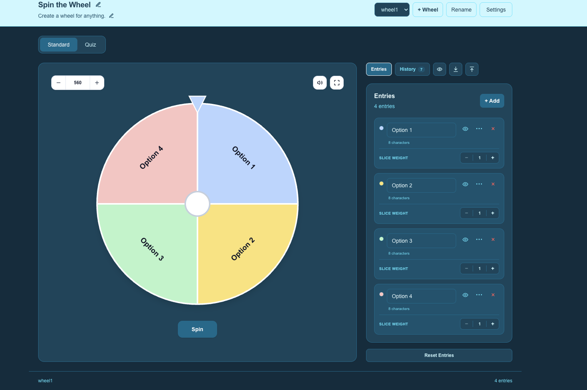
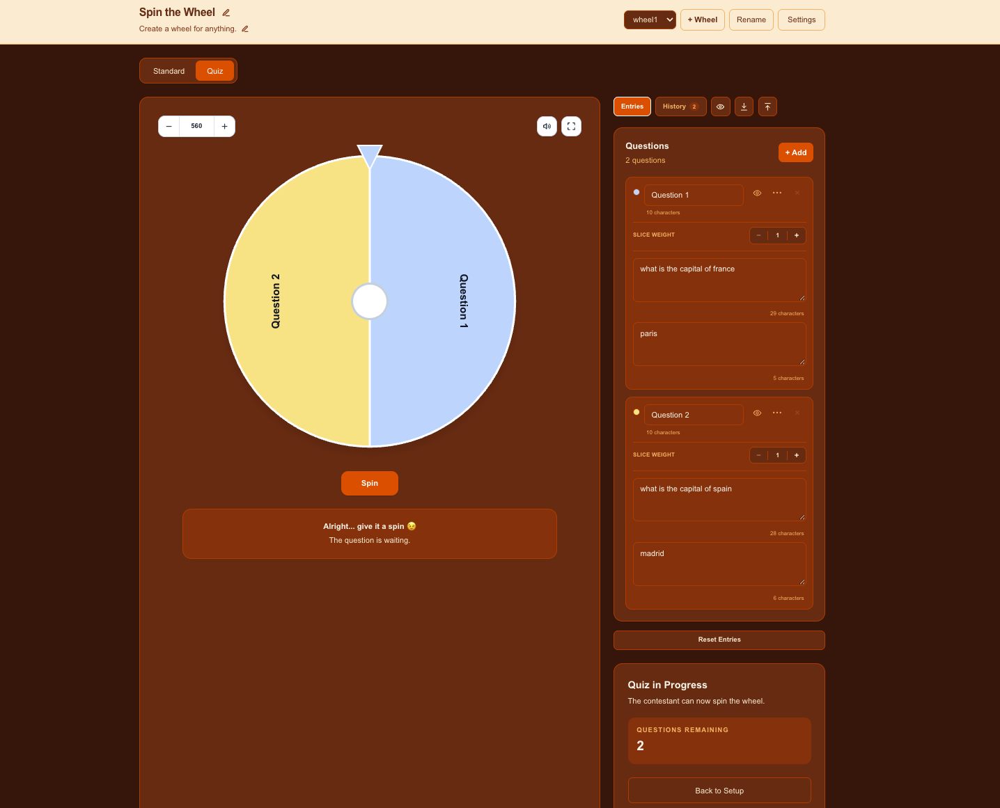

# Spin the Wheel

A customizable wheel application for random selections, quizzes, and everyday decision-making.

Built with **Next.js**, **React**, **TypeScript**, and **Tailwind CSS**.

## Screenshots

### Standard Mode



### Quiz Mode



## Features

### 🎡 Wheel Builder

- Create and manage multiple wheels
- Add, edit, duplicate, hide, and remove entries
- Customize wheel titles and descriptions
- Adjust slice weights for weighted selections
- Change wheel size and spin settings
- Rename or delete wheels from the main interface

### 🎯 Standard Mode

Use the wheel for anything that needs a random selection:

- Decisions
- Names
- Activities
- Games
- Lists
- Custom choices

### 🧠 Quiz Mode

Create interactive question-and-answer quizzes directly on the wheel.

- Add questions and answers to each entry
- Questions remain hidden until the wheel finishes spinning
- Reveal answers with the **Show Answer** button
- Progress through questions one spin at a time
- Keep quiz history separate from standard spin history

### 🎨 Appearance and Controls

- Multiple appearance themes
- Responsive interface
- Adjustable wheel size
- Configurable spin speed and duration
- Optional sound controls
- Slice visibility controls
- Import and export wheel data as JSON

### 📜 History

Completed spins can be recorded with:

- Selected entry
- Mode
- Question, when applicable
- Timestamp

## Tech Stack

- **Next.js 16**
- **React 19**
- **TypeScript**
- **Tailwind CSS 4**
- **ESLint**
- **Turbopack**

## Getting Started

### Clone the repository

```bash
git clone [https://github.com/Franklindot04/spin-the-wheel.git](https://github.com/Franklindot04/spin-the-wheel.git)
cd spin-the-wheel
```

### Install dependencies

```bash
npm install
```

### Start the development server

```bash
npm run dev
```

Open the application at [http://localhost:3000](http://localhost:3000).

## Production Build

Run linting and create an optimized production build:

```bash
npm run lint
npm run build
```

Start the production server:

```bash
npm run start
```

## Data

Wheel configurations and spin history are stored locally in the browser.

The application also supports exporting and importing wheel data as JSON. This makes it possible to back up wheel configurations, restore them later, or move them between browsers and environments.

## Project Status

This project is under active development.

The current release establishes the core foundation for:

- Wheel builder and entry management
- Multi-wheel management
- Standard random-selection mode
- Quiz mode
- Appearance themes and settings
- Spin and quiz history
- Local browser persistence
- JSON data import and export

Further improvements and refinements are planned for future releases.

## License

This project is licensed under the [MIT License](./LICENSE).